# Bağlı Listeler - 2
## Doubly & Circular Linked Lists

<div class="pt-12">
  <span @click="$slidev.nav.next" class="px-2 py-1 rounded cursor-pointer" hover="bg-white bg-opacity-10">
    INF 221 – Veri Yapıları ve Algoritmalar <carbon:arrow-right class="inline"/>
  </span>
</div>

<div class="abs-br m-6 flex gap-2">
  <button @click="$slidev.nav.openInEditor()" title="Open in Editor" class="text-xl slidev-icon-btn opacity-50 !border-none !hover:text-white">
    <carbon:edit />
  </button>
  <a href="https://github.com/slidevjs/slidev" target="_blank" alt="GitHub" title="Open in GitHub"
    class="text-xl slidev-icon-btn opacity-50 !border-none !hover:text-white">
    <carbon:logo-github />
  </a>
</div>

---
transition: fade-out
---

# 📋 İçindekiler

<v-clicks>

- 🔗 **Doubly Linked List (Çift Yönlü Bağlı Liste)**
  - Tanım ve Avantajlar
  - Singly Linked List ile Karşılaştırma
  - Temel İşlemler

- 🔄 **Circular Linked List (Dairesel Bağlı Liste)**
  - Yapı ve Özellikler
  - Circular Singly Linked List
  - Temel Operasyonlar

- 🔬 **Araştırma Soruları**

</v-clicks>

---
layout: two-cols
transition: slide-up
---

# Doubly Linked List Nedir?

<v-clicks>

## 🎯 Temel Özellikler

- Her düğüm **iki pointer** içerir
  - `previous` → Önceki düğüm
  - `next` → Sonraki düğüm
  
- **Çift yönlü** gezinme imkanı

- Daha **esnek** veri yapısı

</v-clicks>

::right::

<v-clicks>

## ✨ Ana Avantajlar

<div class="mt-8">

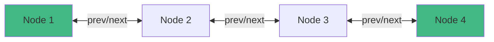

</div>

- İleri **VE** geri yönde hareket
- Önceki düğüm pointer'ı olmadan **silme**
- Daha hızlı **arama** işlemleri

</v-clicks>

---
transition: slide-left
---

# Singly vs Doubly Linked List

<div class="grid grid-cols-2 gap-4 mt-8">

<div v-click>

## 🔗 Singly Linked List

```java
private static class Node {
    private int data;
    private Node next;  // Tek yön
    
    public Node(int data) {
        this.data = data;
        this.next = null;
    }
}
```

<div class="text-red-400 mt-4">
❌ Sadece ileri yönde gezinme<br>
❌ Silme için önceki düğüm gerekli
</div>

</div>

<div v-click>

## 🔗🔗 Doubly Linked List

```java
private static class Node {
    private int data;
    private Node previous; // Önceki
    private Node next;     // Sonraki
    
    public Node(int data) {
        this.data = data;
        this.previous = null;
        this.next = null;
    }
}
```

<div class="text-green-400 mt-4">
✅ Çift yönlü gezinme<br>
✅ Bağımsız silme işlemi
</div>

</div>

</div>

---
layout: center
class: text-center
transition: fade
---

# 🎨 Doubly Linked List Yapısı

<div class="mt-12">

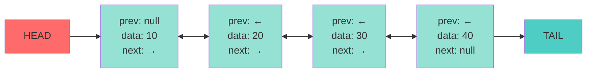

</div>

---
transition: slide-up
---

# 🖨️ Yazdırma İşlemleri

<div class="grid grid-cols-2 gap-8">

<div v-click>

## İleri Yönde Yazdırma

```java {all|2-3|5-9|10-11}
public void printForward() {
    if(head == null)
        return;
    
    Node current = head;
    while(current != null) {
        System.out.print(current.data + "->");
        current = current.next;
    }
    System.out.print("null");
    System.out.println();
}
```

<div class="mt-4 text-blue-400">
Çıktı: 10->20->30->40->null
</div>

</div>

<div v-click>

## Geri Yönde Yazdırma

```java {all|2-3|5-9|10-11}
public void printBackward() {
    if(tail == null)
        return;
    
    Node current = tail;
    while(current != null) {
        System.out.print(current.data + "->");
        current = current.previous;
    }
    System.out.print("null");
    System.out.println();
}
```

<div class="mt-4 text-green-400">
Çıktı: 40->30->20->10->null
</div>

</div>

</div>

---
transition: slide-left
---

# 📏 Liste Uzunluğu Bulma

<div class="flex justify-center items-center h-full">

```java {all|2-3|5-6|7-11|12}
public int findLength() {
    if(head == null)
        return 0;
    
    int count = 0;
    Node current = head;
    
    while(current != null) {
        count++;
        current = current.next;
    }
    return count;
}
```

</div>

<div v-click class="mt-8 text-center">

### ⏱️ Zaman Karmaşıklığı: **O(n)**

</div>

---
layout: center
class: text-center
transition: fade
---

# 🛠️ Temel İşlemler

<div class="mt-12 grid grid-cols-3 gap-8">

<div v-click class="p-6 rounded-lg bg-gradient-to-br from-blue-500 to-blue-700">
<div class="text-4xl mb-4">➕</div>
<div class="text-xl font-bold">Ekleme</div>
<div class="text-sm mt-2">Başa / Sona / Araya</div>
</div>

<div v-click class="p-6 rounded-lg bg-gradient-to-br from-red-500 to-red-700">
<div class="text-4xl mb-4">➖</div>
<div class="text-xl font-bold">Silme</div>
<div class="text-sm mt-2">Baştan / Sondan / Aradan</div>
</div>

<div v-click class="p-6 rounded-lg bg-gradient-to-br from-green-500 to-green-700">
<div class="text-4xl mb-4">🔍</div>
<div class="text-xl font-bold">Arama</div>
<div class="text-sm mt-2">İleri / Geri Yönde</div>
</div>

</div>

---
transition: slide-up
---

# ➕ Başa Ekleme (Insert First)

<div class="grid grid-cols-2 gap-6">

<div>

```java {all|2|4-5|6-8|9-10}
public void insertFirst(int value) {
    Node newNode = new Node(value);
    
    if(isEmpty())
        tail = newNode;
    else
        head.previous = newNode;
    
    newNode.next = head;
    head = newNode;
}
```

<div v-click class="mt-4">

### 📊 Karmaşıklık
- **Zaman:** O(1)
- **Alan:** O(1)

</div>

</div>

<div v-click>

### Görsel Adımlar

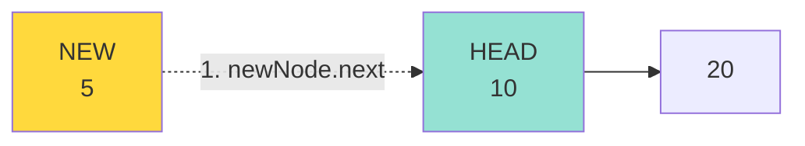

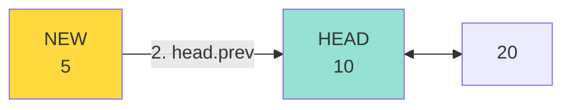

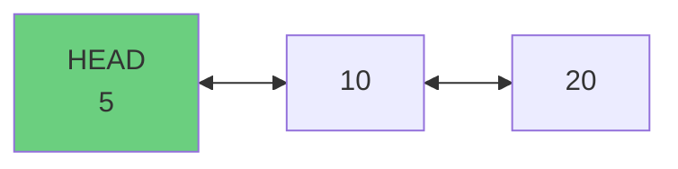

</div>

</div>

---
transition: slide-left
---

# ➕ Sona Ekleme (Insert Last)

<div class="grid grid-cols-2 gap-6">

<div>

```java {all|2|4-5|6-9|10}
public void insertLast(int value) {
    Node newNode = new Node(value);
    
    if(isEmpty())
        head = newNode;
    else {
        tail.next = newNode;
        newNode.previous = tail;
    }
    tail = newNode;
}
```

<div v-click class="mt-4">

### 📊 Karmaşıklık
- **Zaman:** O(1)
- **Alan:** O(1)

</div>

</div>

<div v-click>

### Görsel Adımlar

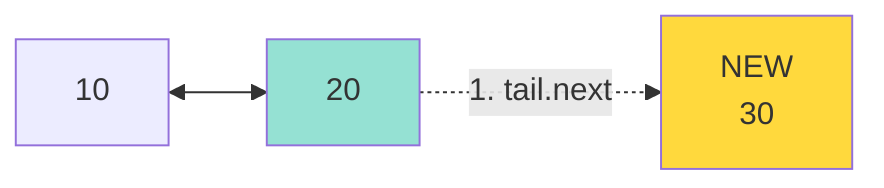

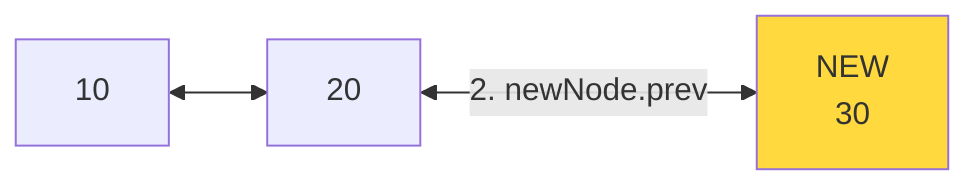

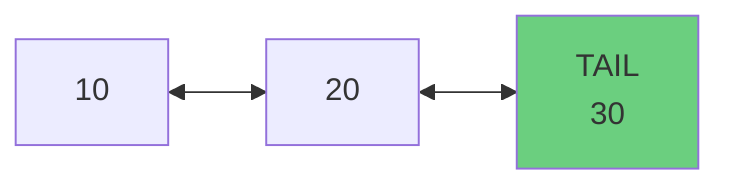

</div>

</div>

---
transition: slide-up
---

# ➕ Araya Ekleme (Insert Any)

```java {all|2-6|8|9-14|15-26}
public void insertAny(int value, int position) {
    if(position < 1 || position > findLength() + 1) {
        System.out.println("Out of bounds!");
        System.out.printf("Enter [1, %d].\n", findLength() + 1);
        return;
    }
    
    Node newNode = new Node(value);
    if(position == 1) {
        if(head != null)
            head.previous = newNode;
        newNode.next = head;
        head = newNode;
        return;
    } else {
        Node current = head;
        for(int i = 1; i < position - 1; i++)
            current = current.next;
        
        if(current.next == null)
            tail = newNode;
        newNode.previous = current;
        newNode.next = current.next;
        current.next = newNode;
        if(newNode.next != null)
            newNode.next.previous = newNode;
    }
}
```

---
transition: fade
---

# 🎯 Araya Ekleme - Görsel Örnek

<div class="flex flex-col items-center justify-center h-full">

<div v-click="1">

### Başlangıç Durumu
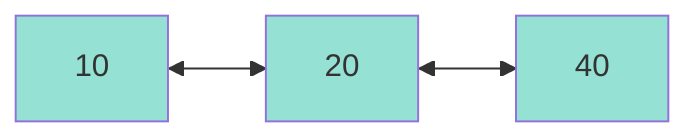

</div>

<div v-click="2" class="mt-8">

### Position 3'e 30 Ekleniyor
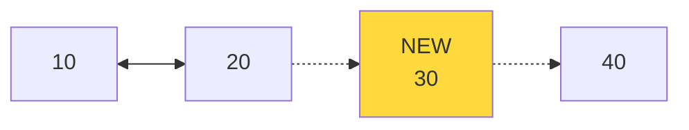

</div>

<div v-click="3" class="mt-8">

### Sonuç
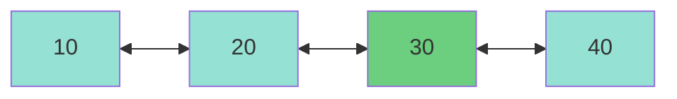

</div>

</div>

---
transition: slide-left
---

# ➖ İlk Düğümü Silme (Delete First)

<div class="grid grid-cols-2 gap-6">

<div>

```java {all|2-3|5|6-7|8-10|11-12}
public Node deleteFirst() {
    if(isEmpty())
        throw new NoSuchElementException();
    
    Node temp = head;
    if(head == tail)
        tail = null;
    else
        head.next.previous = null;
    
    head = head.next;
    temp.next = null;
    return temp;
}
```

<div v-click class="mt-4">

### 📊 Karmaşıklık
- **Zaman:** O(1)
- **Alan:** O(1)

</div>

</div>

<div v-click>

### Silme Süreci

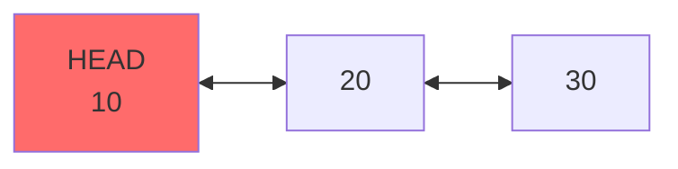

<div class="mt-4">⬇️</div>

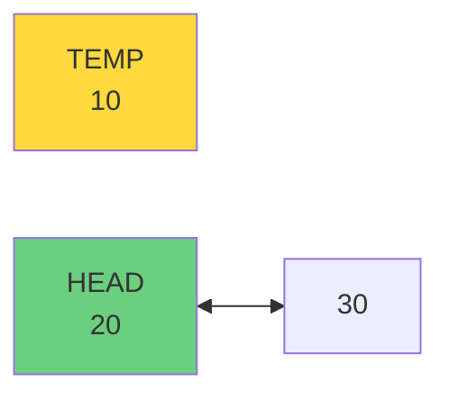

<div class="mt-4 text-center text-sm">
✅ İlk düğüm silindi ve döndürüldü
</div>

</div>

</div>

---
transition: slide-up
---

# ➖ Son Düğümü Silme (Delete Last)

<div class="grid grid-cols-2 gap-6">

<div>

```java {all|2-3|5|6-7|8-10|11-12}
public Node deleteLast() {
    if(isEmpty())
        throw new NoSuchElementException();
    
    Node temp = tail;
    if(head == tail)
        head = null;
    else
        tail.previous.next = null;
    
    tail = tail.previous;
    temp.previous = null;
    return temp;
}
```

<div v-click class="mt-4">

### 📊 Karmaşıklık
- **Zaman:** O(1)
- **Alan:** O(1)

</div>

</div>

<div v-click>

### Silme Süreci

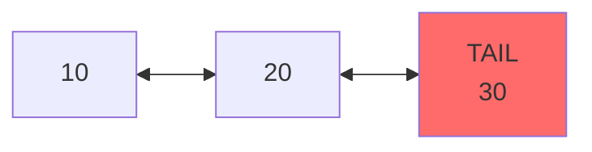

<div class="mt-4">⬇️</div>

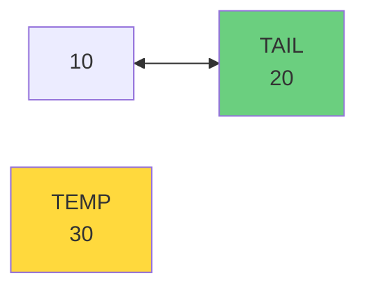

<div class="mt-4 text-center text-sm">
✅ Son düğüm silindi ve döndürüldü
</div>

</div>

</div>

---
transition: slide-left
---

# ➖ Belirli Pozisyondan Silme (Delete Any)

```java {all|2-8|10-19|20-38}
public Node deleteAny(int position) {
    if(isEmpty())
        throw new NoSuchElementException();
    if(position < 1 || position > findLength()) {
        System.out.println("Position is out of bounds!");
        System.out.printf("It must be between 1 and %d.\n", findLength());
        return head;
    }
    
    if(position == 1) {
        Node temp = head;
        if(head == tail)
            tail = null;
        else
            head.next.previous = null;
        head = head.next;
        temp.next = null;
        return temp;
    } else {
        Node current = head;
        int count = 1;
        while(count < position - 1) {
            current = current.next;
            count++;
        }
        Node temp = current.next;
        current.next = temp.next;
        if(temp.next == null) {
            tail = current;
            temp.previous = null;
            return temp;
        } else {
            temp.next.previous = current;
            temp.next = null;
            temp.previous = null;
            return temp;
        }
    }
}
```

---
layout: center
class: text-center
transition: fade
---

# 🔄 Circular Linked List

<div class="text-6xl mb-8">⭕</div>

## Dairesel Bağlı Liste

<div v-click class="mt-8">

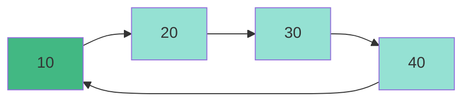

</div>

<div v-click class="mt-6 text-lg">
Son düğüm, <span class="text-green-400 font-bold">ilk düğüme</span> geri bağlanır! 🔁
</div>

---
transition: slide-up
---

# 🌟 Circular Linked List Özellikleri

<div class="grid grid-cols-2 gap-8 mt-8">

<div v-click>

## ✨ Temel Özellikler

- Son düğüm → İlk düğüme işaret eder
- **NULL pointer yoktur** 🚫
- Sürekli gezinme imkanı
- **Last pointer** ile takip

</div>

<div v-click>

## 🎯 Avantajlar

- ✅ Döngüsel yapılar için ideal
- ✅ Round-robin algoritmaları
- ✅ Dairesel buffer uygulamaları
- ✅ Oyun sıra sistemleri

</div>

</div>

<div v-click class="mt-12">

## 📋 Türler

<div class="flex gap-8 mt-4">

<div class="p-4 rounded-lg bg-blue-500 bg-opacity-20">
🔗 Circular Singly Linked List
</div>

<div class="p-4 rounded-lg bg-purple-500 bg-opacity-20">
🔗🔗 Circular Doubly Linked List
</div>

</div>

<div class="mt-4 text-sm text-gray-400">
Bu derste sadece Circular Singly Linked List işlenecektir.
</div>

</div>

---
transition: slide-left
---

# 🏗️ Circular Singly Linked List Yapısı

<div class="grid grid-cols-2 gap-6">

<div>

## Node Sınıfı

```java {all|1|3-4|6-9}
private Node last;

private class Node {
    private int data;
    private Node next;
    
    public Node(int data) {
        this.data = data;
        this.next = null;
    }
}
```

<div v-click class="mt-6 p-4 bg-blue-500 bg-opacity-20 rounded">
💡 <strong>Not:</strong> HEAD yerine LAST pointer kullanılır!
</div>

</div>

<div v-click>

## Liste Oluşturma

```java {all|2-5|7-10|12}
public void createCLL() {
    Node first = new Node(2);
    Node second = new Node(8);
    Node third = new Node(2);
    Node forth = new Node(24);
    
    first.next = second;
    second.next = third;
    third.next = forth;
    forth.next = first; // 🔄 Döngü
    
    last = forth;
}
```

### Sonuç Yapısı

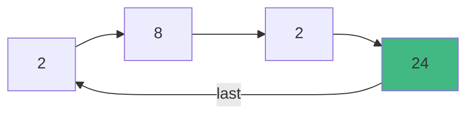

</div>

</div>

---
transition: slide-up
---

# 🖨️ Circular List Yazdırma

<div class="grid grid-cols-2 gap-6">

<div>

```java {all|2-3|5|6-9|10-11}
public void printList() {
    if(last == null)
        return;
    
    Node current = last.next;
    while(current != last) {
        System.out.print(current.data + " ");
        current = current.next;
    }
    System.out.print(current.data);
    System.out.println();
}
```

<div v-click class="mt-4">

### ⚠️ Dikkat Edilmesi Gerekenler

- `last.next` ile başla (ilk düğüm)
- `current != last` kontrolü
- Son elemanı ayrıca yazdır

</div>

</div>

<div v-click>

## 📏 Uzunluk Bulma

```java {all|2-3|5-6|7-11|12}
public int findLength() {
    if(last == null)
        return 0;
    
    int count = 0;
    Node current = last;
    do {
        current = current.next;
        count++;
    } while(current != last);
    
    return count;
}
```

<div class="mt-4 p-4 bg-green-500 bg-opacity-20 rounded">
✅ <strong>do-while</strong> kullanımı önemli!<br>
En az bir kez çalışması gerekir.
</div>

</div>

</div>

---
transition: fade
---

# 🎯 Circular List - Görsel Akış

<div class="flex flex-col items-center justify-center h-full">

<div v-click="1">

### Liste Yapısı
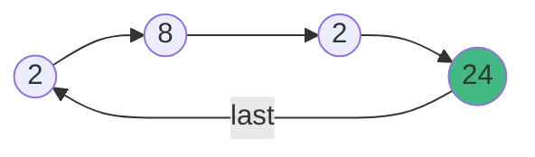

</div>

<div v-click="2" class="mt-8">

### Yazdırma Sırası
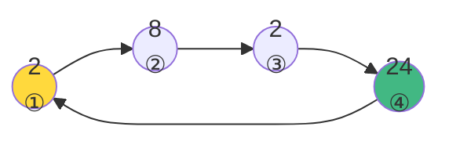

</div>

<div v-click="3" class="mt-6 text-center text-xl">
Çıktı: <span class="text-green-400 font-mono">2 8 2 24</span>
</div>

</div>

---
layout: two-cols
transition: slide-left
---

# 📊 Karşılaştırma Tablosu

## Doubly vs Circular

<v-clicks>

| Özellik | Doubly | Circular |
|---------|--------|----------|
| Yön | ⬅️➡️ İki yön | ➡️ Tek yön |
| Son pointer | NULL | İlk düğüm |
| Bellek | Daha fazla | Daha az |
| Esneklik | ⭐⭐⭐ | ⭐⭐ |
| Kullanım | Genel amaçlı | Döngüsel |

</v-clicks>

::right::

<v-clicks>

## 🎯 Kullanım Alanları

### Doubly Linked List
- Tarayıcı geçmişi (ileri/geri)
- Undo/Redo sistemleri
- MRU Cache

### Circular Linked List
- Round-robin CPU scheduling
- Multiplayer oyun sıraları
- Müzik/video playlisti
- Döngüsel buffer

</v-clicks>

---
layout: center
class: text-center
transition: fade
---

# 🔬 Araştırma Soruları

<div class="grid grid-cols-1 gap-6 mt-12 text-left max-w-4xl mx-auto">

<div v-click class="p-6 rounded-lg bg-gradient-to-r from-blue-500 to-blue-700">
<div class="text-2xl mb-2">❓ Soru 1</div>
<div class="text-lg">Circular Singly Linked List'in <strong>başına</strong> düğüm ekleme mantığını araştırınız.</div>
</div>

<div v-click class="p-6 rounded-lg bg-gradient-to-r from-green-500 to-green-700">
<div class="text-2xl mb-2">❓ Soru 2</div>
<div class="text-lg">Circular Singly Linked List'in <strong>sonuna</strong> düğüm ekleme mantığını araştırınız.</div>
</div>

<div v-click class="p-6 rounded-lg bg-gradient-to-r from-red-500 to-red-700">
<div class="text-2xl mb-2">❓ Soru 3</div>
<div class="text-lg">Circular Singly Linked List'ten <strong>ilk düğümü silme</strong> işlemini araştırınız.</div>
</div>

</div>

<div v-click class="mt-8 text-sm text-gray-400">
💡 İpucu: Önceki derslerdeki gibi düğüm örnekleri ve algoritmalar geliştirerek cevaplarınızı destekleyebilirsiniz.
</div>

---
layout: center
class: text-center
transition: slide-up
---

# 🎓 Özet

<div class="grid grid-cols-2 gap-12 mt-12">

<div v-click>

## Doubly Linked List

<div class="text-6xl mb-4">🔗🔗</div>

- Çift yönlü gezinme
- Esnek silme işlemleri
- O(1) başa/sona ekleme/silme
- Daha fazla bellek kullanımı

</div>

<div v-click>

## Circular Linked List

<div class="text-6xl mb-4">⭕</div>

- Döngüsel yapı
- NULL pointer yok
- Round-robin uygulamaları
- Sürekli gezinme

</div>

</div>

<div v-click class="mt-12 text-2xl">
Her iki veri yapısı da farklı senaryolar için <span class="text-green-400">güçlü çözümler</span> sunar! 🚀
</div>

---
layout: end
class: text-center
transition: fade
---

# Teşekkürler! 🙏

<div class="mt-8 text-xl">
Sorularınız için hazırım! 💬
</div>

<div class="mt-12">
<a href="https://github.com/slidevjs/slidev" target="_blank" class="text-blue-400 hover:text-blue-300">
Made with Slidev ✨
</a>
</div>

<div class="abs-br m-6 text-sm text-gray-500">
INF 221 - Veri Yapıları ve Algoritmalar
</div>